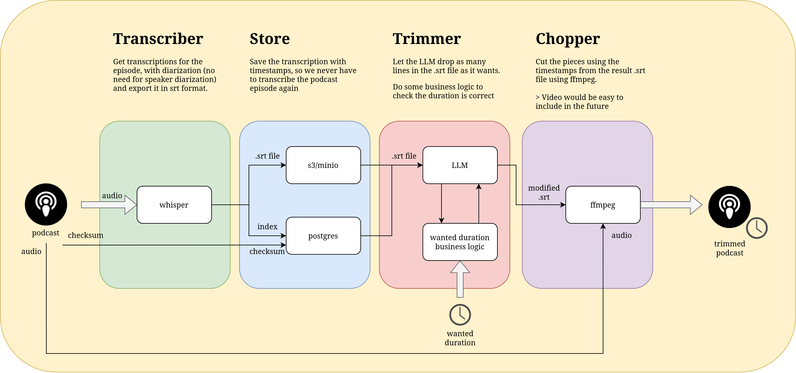

# briefcast

Listen to the most important parts of your favorite podcasts, in the time you
have available.

## The pipeline


### whisper-api

The whisper-api is a RESTful API that provides a way to interface with faster-whisper
via API. It uses `fastapi` and is just a passthrough to the faster-whisper python
transcribe library.

Just send the audio and the API will return the transcribed text as a text file.

```bash
curl \
  -X POST "http://localhost:11000/transcribe?beam_size=5" \
  -F audio_file=@/tmp/podcast.mp3 \
  -o /tmp/transcript.txt
```

You can add `faster-whisper` `transcribe` arguments as query parameters.

> Any audio file will work, since `faster-whisper` uses `ffmpeg` to convert the
> audio to the correct format.

The image is CUDA enabled, so it will use the GPU if available.

### trimmer

The trimmer is a simple fastapi API that takes a whisper transcript and returns
a new transcript with the dropped (removed) lines.

```bash
curl \
  -X POST "http://localhost:11000/trim" \
  -F transcription_file=@/tmp/transcript.txt \
  -o /tmp/trimmed_transcript.txt
```

### chopper

The chopper is a simple fastapi API that takes a whisper transcript file with
dropped (removed) lines, and the original audio file, and returns a new audio
file trimmed accurately to the input transcript file.

```bash
curl \
  -X POST "http://localhost:11000/chop" \
  -F transcription_file=@/tmp/trimmed_transcript.txt \
  -F audio_file=@/tmp/podcast.mp3 \
  -o /tmp/result.mp3
```

## Deployment

briefcast comes with a `docker-compose.yaml`, that enables you to deploy the whole
pipeline easily.
